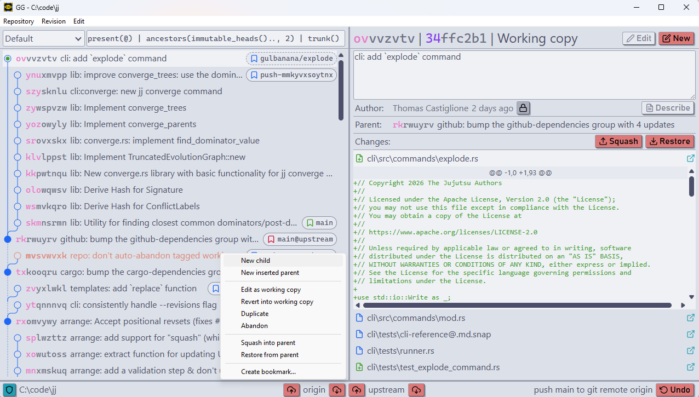

#  GG - Gui for JJ

GG is a GUI for the version control system [Jujutsu](https://github.com/jj-vcs/jj). It takes advantage of Jujutsu's composable primitives to present an interactive view of your repository. Just imagine: what if you were always in the middle of an interactive rebase, but this was actually good?

## Installation
GG is a desktop application with a keyboard & mouse interface, written in [Tauri](https://tauri.app/). Binaries are available for several platforms on the [releases page](https://github.com/gulbanana/gg/releases). Use the `.dmg` or `.app.tar.gz` on MacOS, and the `.msi` or `.exe` on Windows. 

You can also build from source using `cargo install --locked gg-cli`. This non-app build doesn't support as many OS integration features, but it's easier to package and detaches from your shell by default (use `--foreground` to prevent this).

### Setup 
Put `gg` on your path and run it from a Jujutsu workspace, pass the workspace directory as an argument or launch it separately and use the Repository->Open menu item. Tips:
- `gg` or `gg gui` will launch a native application, `gg web` will open a web browser.
- On MacOS, try adding `/Applications/gg.app/Contents/MacOS/` to your PATH environment variable. On Windows, add `C:\Program Files\gg\`.
- When using the app build, `gg &` on MacOS/Linux or `start gg` on Windows will run in the background without blocking your shell.
- `gg --help` will display some possible command-line arguments.

### Configuration
GG uses `jj config`; `revset-aliases.immutable_heads()` is particularly important, as it determines how much history you can edit. GG has some additional settings of its own, with defaults and documentation [here](src/config/gg.toml).

## Features
GG doesn't require [JJ](https://jj-vcs.github.io/jj/latest/install-and-setup/) to run, but you'll need it for tasks GG doesn't cover. What it *can* do:
- Use the left pane to query and browse the log. Click to select revisions, shift-click for multiple selection, double-click to edit (if mutable) or create a new child (if immutable).
- Use the right pane to inspect and edit revisions - set descriptions, issue commands, view their parents and changes.
- Drag revisions around to rebase them; move them into or out of a revision's parents to add merges and move entire subtrees. Or just abandon them entirely.
- Drag files around to squash them into new revisions or throw away changes (restoring from parents).
- Drag bookmarks around to set or delete them. 
- Right click on any of the above for more actions.
- Push and fetch git changes using the bottom bar.
- Undo anything with ⟲ in the bottom right corner.

More detail is available in [the changelog](CHANGELOG.md).

### Future Features
There's no roadmap as such, but items on [the to-do list](TODO.md) may or may not be implemented in future. Just about everything is subject to change for now, including the name.

### Known Issues
GG is lightly maintained and will have bugs. In theory it can't corrupt a repository thanks to the operation log, but it never hurts to make backups. 

If your repo is "too large" some features will be disabled for performance. See [the default config](src/config/gg.toml) for details.

## Development  
Recommended IDE: [VS Code](https://code.visualstudio.com/) + [rust-analyzer](https://marketplace.visualstudio.com/items?itemName=rust-lang.rust-analyzer) + [Svelte](https://marketplace.visualstudio.com/items?itemName=svelte.svelte-vscode) + [Tauri](https://marketplace.visualstudio.com/items?itemName=tauri-apps.tauri-vscode).

Initial setup:
1. Run the first frontend build: `npm install && npm run build`. Future builds will be done automatically by `cargo tauri` or `cargo publish`.
2. (Optional) Install the Tauri CLI: `cargo install tauri-cli --version "^2.0.0" --locked`. This allows you to use `cargo tauri` instead of `npm run tauri`.
3. (Linux) Install system dependencies (on Debian-likes, `apt install libpango1.0-dev libatk1.0-dev libgdk-pixbuf2.0-dev libgtk-3-dev libjavascriptcoregtk-4.1-dev libwebkit2gtk-4.1-dev`).

Some useful commands:
* `cargo check`, `npm run check` - execute type checkers.
* `cargo test`, `npm run test` - execute unit tests.
* `cargo gen` - update the IPC message types in app/messages from src/messages.rs.
* `cargo tauri dev` - launch a debug build with automatic reloading.
* `cargo tauri dev -- -- --debug` - run locally with --debug. Yes, both `--` are necessary.
* `cargo tauri build` - create a standard release build. Require codesigning setup.
* `cargo tauri build --target universal-apple-darwin` - create a fat binary for MacOS.

[DESIGN.md](DESIGN.md) has some basic information about how GG works and why.
